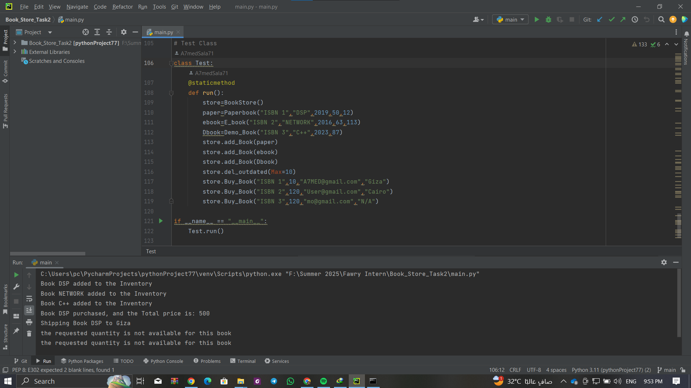

# Bookstore Inventory System

A simple object-oriented Python system for managing a bookstore that supports paper books, e-books, and demo books. The system allows for inventory management, purchasing, delivery handling, and removal of outdated books.

## 📚 Features

- **Inventory Management**  
  - Add books to inventory
  - Remove outdated books by publication year

- **Book Types (Using Inheritance and Abstraction)**  
  - `Paperbook`: Physical books with stock quantity  
  - `E_book`: Digital books (one at a time)  
  - `Demo_Book`: Free demo, not for sale or delivery  

- **Purchase Process**
  - Verify book availability
  - Reduce stock on successful purchase
  - Handle delivery to physical address or email

## 🏗️ Structure

- `Book (ABC)`: Abstract base class for all book types
- `Paperbook`, `E_book`, `Demo_Book`: Derived classes implementing specific behaviors
- `Invent`: Inventory class managing books
- `BookStore`: Facilitates adding, purchasing, and removing books
- `Test`: Contains a static method to demonstrate system behavior

## 📦 Example Output

Running the system will:
- Add 3 books
- Remove books older than a defined threshold (10 years)
- Attempt purchases for each type with delivery

## 🔍 How to Run

1. Make sure your script file is named `main.py`.
2. Open terminal and navigate to the script's directory
3. Run using:

```bash
python main.py
```

## 💡 Sample Output

```
Book DSP added to the Inventory
Book NETWORK added to the Inventory
Book C++ added to the Inventory
Book DSP purchased, and the Total price is: 500
Shipping Book DSP to Giza
the requested quantity is not available for this book
Demo Book can not be delivered of bought
```

## 📧 Contact / Author

- **Author:** Ahmed Salah
- **Email:** a7med@gmail.com (demo)
- **Project Date:** July 2025

## 🖼️ Screenshot

Below is a screenshot from the running app (console output):




## 📝 Notes

- Code uses OOP principles: abstraction, inheritance, polymorphism.
- You can extend the system to support additional formats or integrate with a GUI/database.
